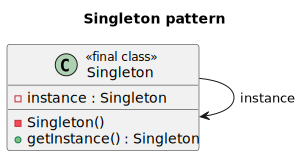

# Deign Patterns

## Creational

Creational patterns are a set of design patterns in software development that focus on creating objects in a way that is flexible, extensible, and reusable. They provide solutions to common problems related to object creation and initialization, ensuring that the process is efficient and maintainable.

There are several key creational patterns, each addressing different scenarios:

Singleton: This pattern ensures that only one instance of a class is created and provides a global point of access to it. It is useful when you need to restrict object creation to a single instance, such as for database connections or configuration settings.

Factory Method: This pattern delegates the responsibility of object creation to subclasses, allowing for the creation of different types of objects without tightly coupling the code to specific classes. This is useful when you want to create objects that follow a common interface but have different implementations.

Abstract Factory: This pattern provides an interface for creating families of related or dependent objects. It allows you to create objects that are part of a larger system while maintaining a separation of concerns. For example, you can have a factory for creating different UI elements like buttons and text boxes.

Builder: This pattern separates the construction of an object from its representation, allowing the same construction process to create different representations. It is useful when you want to create complex objects step by step, providing flexibility in the creation process.

Prototype: This pattern allows you to create new objects by cloning existing ones, avoiding the need to create them from scratch. It is useful when the creation of an object is expensive or complex, and you want to create new instances based on existing ones.

Each creational pattern has its own advantages and use cases, and choosing the right one depends on the specific requirements of your project. By applying these patterns, you can improve the maintainability, flexibility, and reusability of your code.

### Singleton Pattern
<!--

@startuml Diagram
class Singleton
{
    - instance: Singleton
    - Singleton()
    + getInstance(): Singleton
}

Singleton::

@enduml
-->



The Singleton pattern is a design pattern that restricts the instantiation of a class to a single object. This pattern ensures that there is only one instance of a class throughout the application and provides a global point of access to that instance.

In PHP, implementing the Singleton pattern involves the following steps:

Make the constructor of the class private to prevent its direct instantiation from outside the class.

Declare a static private variable to hold the single instance of the class.

Define a static public method that will be responsible for creating and returning the single instance of the class.

Inside the method, check if the instance variable is empty. If it is, create a new instance of the class and assign it to the instance variable. If the instance variable already has a value, simply return it.

Here's an example of implementing the Singleton pattern in PHP:

> Singleton.php

```php

<?php

declare(strict_types=1);

namespace DesignPatterns\Creational\Singleton;

use Exception;

final class Singleton
{
    private static ?self $instance = null;

    // Private constructor to prevent direct instantiation
    private function __construct()
    {
        // initialization code
    }

    private function __clone()
    {
        // Prevent clone instantiation
    }

        public function __wakeup()
    {
        throw new Exception('Cannot unserialize singleton');
    }

    // The static method thatcontrols the access to the singleton instance
    public static function getInstance()
    {
        if (null === self::$instance)
        {
            self::$instance = new self();
        }
        return self::$instance;
    }
}
```

> Usage
>
```php
$instance = Singleton::getInstance();
```

### Test

> ../Tests/SingletonTest.php

```php
<?php

declare(strict_types=1);

namespace DesignPatterns\Creational\Singleton\Tests;

use DesignPatterns\Creational\Singleton\Singleton;
use PHPUnit\Framework\TestCase;

class SingletonTest extends TestCase
{
    public function testUniqueness()
    {
        $firstCall = Singleton::getInstance();
        $secondCall = Singleton::getInstance();

        $this->assertInstanceOf(Singleton::class, $firstCall);
        $this->assertSame($firstCall, $secondCall);
    }
}
```
